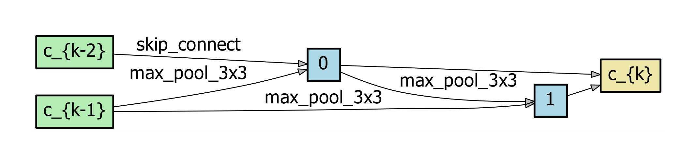
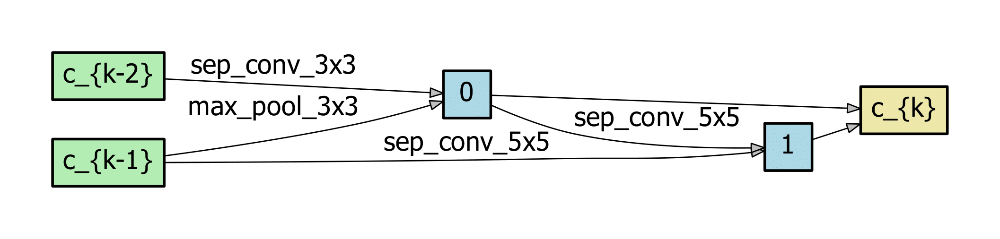
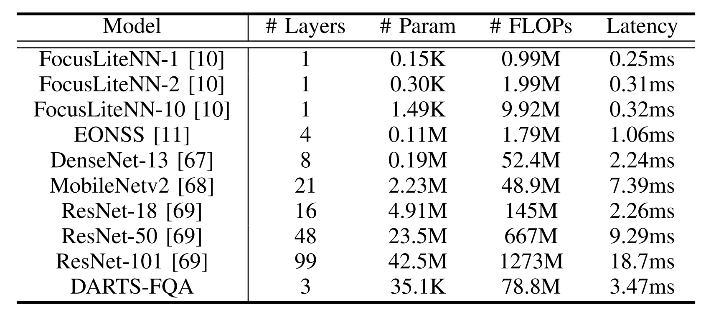
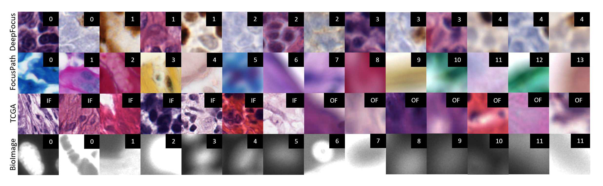
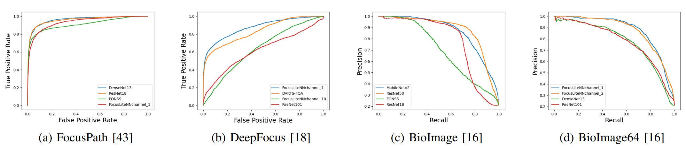
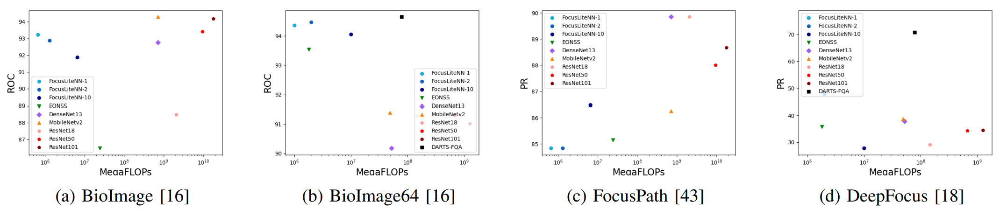
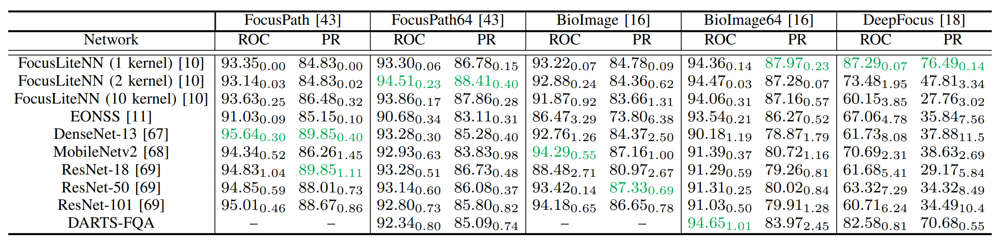
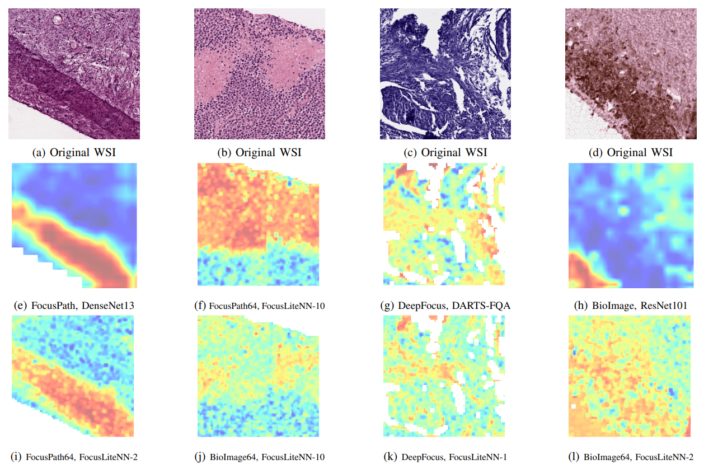

# DARTS-FQA

We propose a lightweight searched architecture for Digital Pathology applications. The network architectures are searched on [FocusPath](https://doi.org/10.5281/zenodo.3926181), [DeepFocus](https://zenodo.org/record/1134848#.YV8VqWLMLD4), and [BioImage](https://bbbc.broadinstitute.org/BBBC006) datasets using [Differentiable Architecture Search (DARTS)](https://github.com/quark0/darts), and shows strong generalizability performance relative to traditional networks.

## Architectures
- **Overall architecture**

Above is the structure of each searched network. The reduction cells are the searched part of this architecture. A reduction cell refers to a directed acyclic graph with both nodes and edges. Nodes are feature maps, while edges each belong to a candidate operation: 3x3 separable convolutions, 3x3 and 5x5 dilated separable convolutions, 3x3 maxpooling, 3x3 average pooling, and skip-connections.

Here are the searched reduction cell architectures searched on FocusPath (top), DeepFocus (center), and BioImage (bottom).
  

We also include pretrained models for the traditional networks involved in this experiment.

- **[FocusLiteNN:](https://github.com/icbcbicc/FocusLiteNN#6-license)** This is a high efficiency, shallow CNN designed for Focus Quality Assessment. The number of input channels used for the experiment were 1, 2, and 10. The accompanying paper can be found [here](https://arxiv.org/abs/2007.06565).

- **[EONSS:](https://github.com/icbcbicc/EONSS-demo)** End-to-End Optimized deep neural Network using Synthetic Scores is a blind image quality assessment CNN. The accompanying paper can be found [here](https://ece.uwaterloo.ca/~z70wang/publications/iciar19_DNN.pdf).

- **[DenseNet:](https://github.com/liuzhuang13/DenseNet)** Densely Connected Convolutional Network. The accompanying paper can be found [here](https://openaccess.thecvf.com/content_cvpr_2017/papers/Huang_Densely_Connected_Convolutional_CVPR_2017_paper.pdf).

- **[ResNet:](https://github.com/KaimingHe/deep-residual-networks)** Residual Networks. In this experiment, ResNet18, ResNet50, and ResNet101 are trained, where the number next to ResNet refers to the number of layers. The accompanying paper can be found [here](https://openaccess.thecvf.com/content_cvpr_2016/papers/He_Deep_Residual_Learning_CVPR_2016_paper.pdf).

- **[MobileNetv2:](https://github.com/MG2033/MobileNet-V2)** Mobile CNN architecture. The accompanying paper can be found [here](https://arxiv.org/pdf/1801.04381.pdf).

The complexities for each network used in the experiment are listed in the following table, in terms of network layers, parameters, floating point operations (FLOPs) and GPU latency for the analysis of a single 64 x 64 image.


## Datasets
We search the architectures on FocusPath, DeepFocus, and BioImage, then evaluate them on these respective datasets. We also transfer these architectures to the TCGA dataset for a final evaluation.

- **FocusPath:** Contains 8640 patches of size 1024 x 1024 extracted from nine different stained slides at 15 z-levels. 5200 of these patches are randomly selected for training. The dataset called `FocusPath` refers to a 235 x 235 input patch size, while a 64 x 64 input size dataset was also included in the experiment, called `FocusPath64`. The full dataset can be found on Zenodo under a Creative Commons License [](https://doi.org/10.5281/zenodo.3926181).

- **DeepFocus:** Contains 118,800 patches of size 64 x 64, consisting of 16 slides with 4 types of stains in 6 separate focus classes. The training set used for this experiment is composed of 105,600 randomly selected patches. The full dataset can be found on Zenodo at [](https://doi.org/10.5281/zenodo.1134848).

- **BioImage:** Contains 52,224 grayscale patches of size 696 x 520, with 12 separate focus classes. The training set for this experiment contains 47,001 randomly selected patches. The dataset called `BioImage` refers to a 235 x 235 input patch size, while a 64 x 64 input size dataset was also included in the experiment, called `BioImage`. The full dataset can be downloaded from the [Broad Bioimage Benchmark Collection](https://bbbc.broadinstitute.org/BBBC006).

- **TCGA:** Contains 14,371 patches in total from 52 different organ types. 11,328 patches are in-focus, while 3,043 patches are out-of-focus. All patches in this dataset are used for transferability testing. The full dataset can be found on Zenodo at [](https://doi.org/10.5281/zenodo.3910757).

The following figure shows some example tissues from each of these datasets at various focus levels.


## Searching Procedure
The searching procedure is taken directly from the existing [DARTS](https://github.com/quark0/darts) framework. 

## Performance
The searched networks are trained on FocusPath, DeepFocus, and BioImage, and compared with the traditional CNN architectures. The following ROC and PR curves and their AUC values shows intermediate transferability performance across datasets.




## Heatmap Creation
This code is also capable of generating spatial focus quality distributions for images in the TCGA dataset. The following shows DARTS-FQA heatmap performance on two dataset examples compared with other CNNs.



## Usage

For all usage cases, `torch`, `torchvision`, `tensorboard`, `numpy`, `scikit-learn`, `matplotlib`, and `pillow` are required.
### Pretrained Models
Pretrained models for DARTS-FQA and the other CNNs are provided in the `/pretrained_models` folder. The script test_model.py runs evaluations. 

First, download the desired dataset for testing from the provided links, and store them to a local directory.

Then open `test_demo.sh` and edit the following:
- Change the path of `--data` to the local path where the downloaded dataset was stored.
- Change the name of `--dataset` to the name of the dataset you wish to evaluate. The valid names are `FocusPath`, `DeepFocus`, `BioImage`, `FocusPath64`, `BioImage64`, and `TCGA` (all case-insensitive). DARTS-FQA only uses `FocusPath64`, `BioImage64`, and `DeepFocus`. 
- Select the architecture `--arch` you wish to evaluate. The valid names are `DARTS-FQA`, `FocusLiteNN-1`, `FocusLiteNN-2`, `FocusLiteNN-10`, `EONSS`, `DenseNet13`, `MobileNetv2`, `ResNet18`, `ResNet50`, and `ResNet101`.
- Change the `--model_path` according to the chosen dataset and architecture. An example is `./pretrained_models/focuspath/eonss.pt`
- Change the `--output_path` to the local path where you would like testing metrics including ROC and PR to be stored. 

Optionally,
- Change `--layers` to the number of layers you want DARTS-FQA to have (1, 2, or 3 layers supported.)
- Change `--input_channels` to the number of input channels for DARTS-FQA.

Now, run the demo script to start testing:

```
cd path/to/this/repo
sh test_demo.sh
```

### Searching

First, download the desired dataset for testing from the provided links, and store them to a local directory.

Then open `search_demo.sh` and edit the following:
- Change the path of `--data` to the local path where the downloaded dataset was stored.
- Change the name of `--dataset` to the name of the dataset you wish to evaluate. The valid names are `FocusPath`, `DeepFocus`, `BioImage`, `FocusPath64`, `BioImage64`, and `TCGA` (all case-insensitive). DARTS-FQA only uses `FocusPath64`, `BioImage64`, and `DeepFocus`.
- Select the architecture `--arch` you wish to evaluate. The valid names are `DARTS-FQA`, `FocusLiteNN-1`, `FocusLiteNN-2`, `FocusLiteNN-10`, `EONSS`, `DenseNet13`, `MobileNetv2`, `ResNet18`, `ResNet50`, and `ResNet101`.
- Change the `--output_path` to the local path where you would like testing metrics including ROC and PR to be stored. 

Optionally,
- Change `--layers` to the number of layers you want DARTS-FQA to have (1, 2, or 3 layers supported.)
- Change `--nodes` to the number of nodes per layer for DARTS-FQA.
- Change `--input_channels` to the number of input channels for DARTS-FQA.

Now, run the demo script to start searching:

```
cd path/to/this/repo
sh search_demo.sh
```

### Training

First, download the desired dataset for testing from the provided links, and store them to a local directory.

Then open `train_demo.sh` and edit the following:
- Change the path of `--data` to the local path where the downloaded dataset was stored.
- Change the name of `--dataset` to the name of the dataset you wish to evaluate. The valid names are `FocusPath`, `DeepFocus`, `BioImage`, `FocusPath64`, `BioImage64`, and `TCGA` (all case-insensitive). DARTS-FQA only uses `FocusPath64`, `BioImage64`, and `DeepFocus`.
- Select the architecture `--arch` you wish to evaluate. The valid names are `DARTS-FQA`, `FocusLiteNN-1`, `FocusLiteNN-2`, `FocusLiteNN-10`, `EONSS`, `DenseNet13`, `MobileNetv2`, `ResNet18`, `ResNet50`, and `ResNet101`.
- Change the `--output_path` to the local path where you would like testing metrics including ROC and PR to be stored. 

Optionally,
- Change `--layers` to the number of layers you want DARTS-FQA to have (1, 2, or 3 layers supported.)
- Change `--init_channels` to the number of input channels for DARTS-FQA.

Now, run the demo script to start training:

```
cd path/to/this/repo
sh train_demo.sh
```

### Heatmap

First, download an SVS whole slide image. The [TCGA Repository](https://portal.gdc.cancer.gov/repository) is a good place to find whole slide images in .svs format. The `heatmap_creation.py` file also requires the `openslide-python` package.

Then open `./heatmap/heatmap_demo.sh` and edit the following:
- Select the architecture `--arch` you wish to evaluate. The valid names are `DARTS-FQA`, `FocusLiteNN-1`, `FocusLiteNN-2`, `FocusLiteNN-10`, `EONSS`, `DenseNet13`, `MobileNetv2`, `ResNet18`, `ResNet50`, and `ResNet101`.
- Change the path of `--img` to where the .svs is saved locally.
- Change the `--genotype` to the name of the DARTS-FQA genotype.
- Select the `--trainset` used to train the model to one of `FocusPath`, `DeepFocus`, `BioImage`, `FocusPath64`, `BioImage64`, and `TCGA` (all case-insensitive). DARTS-FQA only uses `FocusPath64`, `BioImage64`, and `DeepFocus`.
- Change the `--checkpoint_path` to the name of the path with the saved model weights.
- Change `--i_lower`, `--i_upper`, `--j_lower`, and `j-upper` to the coordinates of the boundary around the part of the .svs you wish to assess, where `i` is in the y-axis, and `j` in the x-axis.

Optionally,
- Change `--layers` to the number of layers used for training DARTS-FQA.
- Change `--init_channels` to the number of input channels used for training DARTS-FQA. 
- Change `--patch_size` to change the sampling patch size for the heatmap.
- Change `--stride` to change the sampling stride for the heatmap.

Now, run the demo script to start training:

```
cd path/to/this/repo
sh heatmap_demo.sh
```
